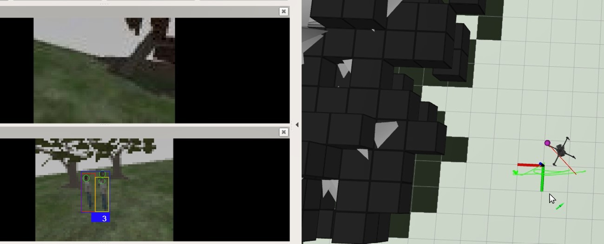
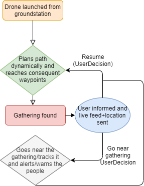

## UAV FOR DETECTING PUBLIC GATHERINGS TO PREVENT SPREAD OF COVID19 
 
# ABSTRACT 

‘According to health experts, a minimum of 21 days is most crucial to break the cycle of infection. If we are not able to manage this pandemic in the next 21 days, the country and your family will be setback by 21 years. If we are not able to manage the next 21 days, then many families will be destroyed forever,' Modi said. Police used rattan canes to beat people into compliance as New Delhi's typically bustling streets and train stations were all-but cleared of people in an unprecedented move to try and slow the spread of the disease. The Police have really done a great work at managing this pandemic but as we know how vast and complex our cities are, there are high chances that public gather in some places or ​gullies ​ and we know that there are many who won’t abide by the rules that the government is trying to impose to save us. 

So as it is not possible for the Police to patrol every gully and street by themselves to check for public gatherings, this autonomous UAV has been designed to roam around the fields suggested by the user and search and detect public gatherings. 
 
With the help of AI it detects gatherings both sparse and dense and also the number of people. It can also detect the masked people and others among the group. 
 
INTRODUCTION The drone is equipped with auto path planning technology. If it is given a waypoint it will figure out the shortest path to it and also avoid all obstacles in its path.  We have tested all the working on a simulation in ROS/Gazebo which is an open-source robotics middleware used to interface virtually like a real robot stack and hence provides a platform to debug and simulate the robot first and then prototype it. This can easily be mapped onto any drone or a pixhawk to be applied on a real drone. 
The path planning algorithms and avoidance have been developed in python fully The computer vision algorithms have been built in pytorch. 
 
## METHOD/WORKFLOW 
 
 
The above diagram explains the workflow of the UAV and how it is to be operated. 1. The drone is launched from the ground station which is basically the home location to the drone. 2. The drone is given waypoints it needs to complete one by one to complete one lap. Piloting and maneuvering the drone is not at all required as it can avoid obstacles and plan its path autonomously. 3. When a gathering is detected, the user is informed about the Count, Live feed video and Location of the same. Now it is the user’s decision to either command the drone to resume its path or go near the gathering to alert/warn them(pre-recorded alert dialect through speakers).  
 
This is a screenshot from the simulated world on which the above method was applied. Actual scene without computer vision running 
 
## With computer vision  
 
There are three camera views in our simulated drone. As you can see it detects even vaguely appearing gatherings of people too and gives the count. On the RHS, the path planning visualization is shown.(RViz used for visualization) The obstacles such as trees are basically mattered with blocks which the robot visualizes for performing the path planning algorithm. The waypoint is the pink ball in the diagram and the auto determined path is shown by the red line. Assembling this system is not a time-consuming method. Moreover this can be applied to common professional drones(DJI , Iris, Parrot) as well as pixhawk equipped drones. 
 
CONCLUSION This can help the police to focus on the areas that need to be patrolled and also make their work simpler.This is a step to stop the spread of COVID19 due to some people engaged in dereliction and neglecting responsibilities. 
